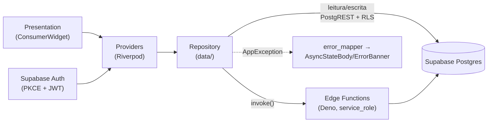

# Arquitetura — EsquemaCore

> Arquitetura **real** encontrada no código (diagnóstico 2026-09-11). Descreve o
> que existe, não um plano. Não é ordem de refatoração (ver `AGENTS.md`).

## Visão geral

Monorepo com três partes:

```
App_Clinica_Psicologia/
├── mobile/     App Flutter (Android, iOS, web, desktop)
├── supabase/   Backend: migrations, seed, Edge Functions (Deno), testes SQL
├── docs/       Documentação
└── scripts/    Validação do Supabase remoto
```

- **Frontend:** Flutter + Riverpod (estado) + GoRouter (navegação) + supabase_flutter.
- **Backend:** Supabase (Postgres + Auth + RLS) + Edge Functions em Deno/TypeScript para operações privilegiadas.
- **Fronteira de segurança:** app usa só a `anon key`; `service_role` só nas Edge Functions.

Tamanho: **~111k linhas** de Dart em **494 arquivos** (`mobile/lib/`) + ~16,7k de
testes. **114 migrations**, **15 Edge Functions**, **33 módulos** de feature.

## Fluxo de dados



O JWT do usuário acompanha tanto as chamadas PostgREST (RLS aplica no banco)
quanto as Edge Functions (`createUserClient` herda RLS; `createServiceClient` a
ignora, só quando necessário).

## App mobile

**Inicialização** — `mobile/lib/main.dart` → `SupabaseBootstrap.initialize()`
(PKCE + auto-refresh) → `ProviderScope(TerapiaEsquemaApp())`. Falha de bootstrap
cai em tela de erro dedicada. Config por `--dart-define-from-file` lida em
`core/config/env_config.dart` (`SUPABASE_URL`, `SUPABASE_ANON_KEY`,
`SHOW_TEST_ACCOUNTS`, `PASSWORD_RESET_REDIRECT_URL`); release exige HTTPS + defines
explícitos (`EnvConfig.validate`).

**Camadas** (`mobile/lib/`): `core/` (config, erros, rede, router, tema, bootstrap)
· `features/<feature>/` (4 camadas: `data/`·`domain/`·`presentation/`·`providers/`)
· `shared/widgets/` · `app.dart` (raiz).

**Estado (Riverpod):** `Provider` (repos singleton) · `FutureProvider(.family)`
(leituras) · `AsyncNotifier`/`FamilyAsyncNotifier` (mutações que `ref.invalidate`)
· `StateNotifier` só no `AuthController` · `StateProvider` (flags). Notifiers não
recebem deps no construtor.

**Navegação/gating:** GoRouter em `appRouterProvider` com `redirect` por
`authControllerProvider`; regras em `core/router/route_access.dart` (prefixos
`/platform/**`, `/psychologist/**`, `/patient/**`). Páginas multi-papel recebem
`ProfileRole role`.

**Tema/responsividade:** tokens em `core/theme/` (`app_colors`, `app_spacing`,
`app_radius`, `app_shadows`, `app_typography`, `app_gradients`, `app_breakpoints`).
Breakpoints 600/768/1024/1440; `AppNavShell` usa `NavigationRail` em ≥1024.

## Backend (Supabase)

**Edge Functions** (`supabase/functions/`) — `_shared/` com `supabase.ts`
(user/service clients), `auth.ts` (`getCallerProfile`, `requireStaff`,
`assertPatientAccess`), `http.ts` (CORS/parse/erros), `errors.ts` (`AppError`).
Contrato: `{ok,data}` / `{ok,error}` → `AppException` no app. Deps Deno pinadas
(`supabase-js@2.49.8`, `pdf-lib@1.17.1`).

**Banco** — RLS em todas as tabelas; política centralizada em funções SQL
(`current_clinic_id()`, `current_role()`, `user_can_access_patient()`,
`is_staff()`). Migrations cronológicas; seed em `supabase/seed.sql`.

## Estado das capacidades

**✅ IMPLEMENTADO** (código presente + testes verdes)
- Auth (login, recuperação/redefinição de senha, deep link), gating por papel.
- CRUD dos 3 papéis: admin (clínicas, usuários, catálogos, planos), psicólogo
  (pacientes, questionários, resultados, dashboard, metas/problemas, check-ins,
  monitor, timeline, genograma, mapa mental, conceitualização, personalidade,
  recursos, biblioteca, relatório PDF), paciente (jornada, questionários,
  resultados liberados, check-ins/monitor próprios, Life Story, psicoeducação).
- Motor de scoring e relatório clínico nas Edge Functions (com testes Deno).

**⚠️ PARCIALMENTE IMPLEMENTADO** (evidência concreta)
- Edição de evento na timeline do paciente — rota ausente
  (`mobile/lib/features/life_story/presentation/my_timeline_page.dart:839` — `// TODO`).
- Cobertura de teste dos **handlers HTTP** das Edge Functions — só a lógica
  `_shared` (scoring, clinical-report) é testada; os 15 handlers não.
- Observabilidade — sem logging/telemetria no runtime (ver `TECH_DEBT.md`).

**📌 PLANEJADO / FORA DESTE REPO**
- Painel **web** (projeto separado; este repo é o app mobile + backend).
- Itens bloqueados por evidência externa (jurídico, licença clínica, SMTP, MFA,
  pentest, contas de loja) — `docs/production-implementation-status.md`.

## CI

`.github/workflows/quality.yml`: **flutter** (`pub get`→`analyze`→`test`→build web→
build appbundle) · **edge-functions** (`deno check` + testes scoring/report) ·
**database** (`supabase start`→`db lint`→RLS smoke→governance). Sem workflow de
deploy (deploy manual — `docs/deploy/`).

## Referências

`CLAUDE.md` (comandos) · `AGENTS.md` (regras) · `docs/CURRENT_STATE.md` (estado) ·
`docs/TECH_DEBT.md` (dívida) · `docs/database-model.md` · `docs/scoring-engine/README.md`.
