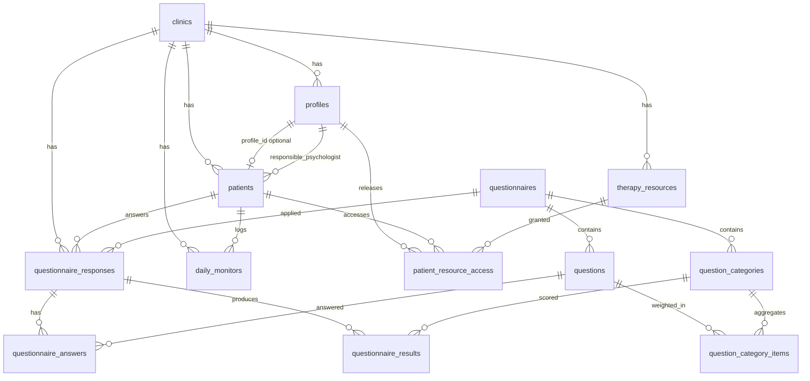

# Modelo de dados — Plataforma Terapia do Esquema (MVP)

Documentação da base PostgreSQL no Supabase. Reflete as migrations em `supabase/migrations/`.

## Visão geral

O modelo é **multi-tenant por clínica** (`clinics`). A maior parte dos dados operacionais carrega `clinic_id` para isolamento futuro via RLS.

**Profissionais** não têm tabela própria: `profiles` com `role` em `admin` ou `psychologist` cobre gestores e psicólogos. Pacientes têm registro em `patients` e, quando houver login, vínculo opcional a `profiles` com `role = patient`.

**Questionários** são catálogo **global** (não por clínica): mesma definição de instrumento para todas as clínicas. A aplicação ao paciente é **por clínica** em `questionnaire_responses`.

---

## Tabelas e objetivo

| Tabela | Objetivo |
|--------|----------|
| `clinics` | Tenant: identidade da clínica e raiz de isolamento. |
| `profiles` | Usuários da plataforma por clínica (admin, psychologist, patient). |
| `patients` | Dados clínicos/demográficos do paciente e vínculo com psicólogo responsável. |
| `questionnaires` | Instrumentos padronizados (código, nome, ativo). |
| `question_categories` | Dimensões de apuração (esquemas, modos, fatores). |
| `questions` | Itens do instrumento, ordem e tipo de resposta. |
| `question_category_items` | Peso de cada pergunta em cada categoria (matriz do motor). |
| `questionnaire_responses` | Sessão de aplicação do questionário a um paciente. |
| `questionnaire_answers` | Valor respondido por pergunta. |
| `questionnaire_results` | Scores calculados por categoria (preenchidos pelo motor). |
| `therapy_resources` | Materiais da clínica (artigos, vídeos, exercícios, links). |
| `patient_resource_access` | Liberação de recurso ao paciente por um profissional. |
| `daily_monitors` | Registro diário (humor, sono, atividade, emoções). |

---

## Relacionamentos principais



### Chaves e enums

- **PK**: `UUID` com `gen_random_uuid()` em todas as tabelas.
- **`profile_role`**: `admin`, `psychologist`, `patient`.
- **`questionnaire_response_status`**: `draft`, `completed`, `cancelled`.
- **`question_answer_type`**: `likert_scale`, `numeric_scale`, `single_choice`, `text`.
- **`therapy_resource_type`**: `article`, `video`, `exercise`, `document`, `link`, `other`.

### Integridade entre tabelas

Regras que exigem leitura de outras linhas (mesma clínica, mesmo questionário) estão em **triggers** (`20250525120008_cross_table_integrity_triggers.sql`), pois `CHECK` no PostgreSQL não aceita subquery.

---

## Fluxo dos questionários

1. **Cadastro do instrumento** (admin da plataforma / seed futuro)
   - Criar `questionnaires`.
   - Criar `question_categories` e `questions`.
   - Popular `question_category_items` (pergunta ↔ categoria + `weight`).

2. **Abertura da aplicação**
   - Inserir `questionnaire_responses` com `status = draft`, `clinic_id`, `patient_id`, `questionnaire_id`.
   - Opcional: preencher `started_at`.

3. **Preenchimento**
   - Para cada pergunta respondida: `INSERT`/`UPDATE` em `questionnaire_answers` (`response_id`, `question_id`, `answer_value`).
   - Uma linha por pergunta por resposta (índice único `response_id + question_id`).

4. **Conclusão**
   - Atualizar `questionnaire_responses`: `status = completed`, `completed_at = now()`.
   - Disparar motor de apuração (etapa futura) → gravar `questionnaire_results`.

5. **Cancelamento**
   - `status = cancelled` sem exigir `completed_at`.

```text
questionnaires
    ├── question_categories
    ├── questions
    │       └── question_category_items (pesos)
    └── questionnaire_responses (por clinic + patient)
            ├── questionnaire_answers
            └── questionnaire_results (após apuração)
```

---

## Fluxo do motor de apuração (planejado, não implementado)

O schema já suporta o pipeline; a **lógica de cálculo** fica para uma função/Edge Function/job posterior.

### Entradas

- `questionnaire_answers.answer_value` para o `response_id` concluído.
- `question_category_items` (`question_id`, `category_id`, `weight`).
- Metadados da pergunta (`scale_min`, `scale_max`, `answer_type`) se necessário para normalização.

### Processamento esperado (por categoria)

Para cada `category_id` do `questionnaire_id`:

1. Listar itens em `question_category_items` da categoria.
2. Buscar respostas correspondentes em `questionnaire_answers`.
3. Calcular agregados, por exemplo:
   - `total_score` = Σ (`answer_value` × `weight`)
   - `average_score` = média ponderada ou simples (regra a validar por instrumento)
   - `percentage` = normalização em relação ao máximo teórico da categoria
4. Derivar `classification` (faixas: baixo / moderado / elevado) conforme tabela de cortes do instrumento.

### Saída

- Um registro em `questionnaire_results` por (`response_id`, `category_id`).
- Índice único evita duplicar resultado da mesma categoria na mesma sessão.

### Uso downstream

- **Dashboard**: agregar `questionnaire_results` por paciente, período e categoria.
- **Mapa mental** (futuro): pode mapear `question_categories.code` para nós/arestas; `therapy_resources` e `patient_resource_access` para conteúdo vinculado ao plano terapêutico.

---

## Autenticação e perfis

### Vínculo `auth.users` ↔ `profiles`

- `profiles.id` é **igual** a `auth.users.id` (FK `profiles_id_fkey_auth_users`, `ON DELETE CASCADE`).
- Login via **Supabase Auth** (e-mail/senha); sem auth customizado no app.
- No signup (ou criação via Dashboard/Admin API), enviar em `raw_user_meta_data`:
  - `clinic_id` (UUID da clínica)
  - `role` (`admin` | `psychologist` | `patient`)
  - `full_name` (opcional)
  - `phone` (opcional)

### Trigger `handle_new_user`

Após `INSERT` em `auth.users`, cria ou atualiza a linha em `profiles` com o mesmo `id`. Se faltar `clinic_id` ou `role`, o usuário auth existe mas **sem profile** — não acessa dados clínicos (RLS nega).

`handle_user_email_updated` mantém `profiles.email` alinhado ao Auth.

### Seed de desenvolvimento

`supabase/seed.sql` insere `auth.users` + `auth.identities` com UUIDs fixos; profiles são criados pelo trigger. Senha de teste local: `TesteMVP2025!`.

---

## RLS e segurança

RLS está **habilitado** em todas as tabelas públicas. Policies na migration `20250525120009_auth_and_rls.sql`.

### Funções auxiliares (`SECURITY DEFINER`)

| Função | Uso |
|--------|-----|
| `current_clinic_id()` | Tenant do usuário logado |
| `current_role()` | `admin`, `psychologist` ou `patient` |
| `current_patient_id()` | `patients.id` quando `profile_id = auth.uid()` |
| `is_staff()` | admin ou psychologist |
| `user_can_access_patient(uuid)` | Regra central de acesso a paciente |
| `user_can_access_response(uuid)` | Via `questionnaire_responses` + paciente |

Todas usam `auth.uid()` e leem `profiles` com bypass controlado de RLS.

### Matriz de acesso (resumo)

| Papel | Escopo |
|-------|--------|
| **admin** | Todos os dados da **própria clínica** (`clinic_id`) |
| **psychologist** | Pacientes com `responsible_psychologist_id = auth.uid()` e vínculos derivados (respostas, monitors, etc.) |
| **patient** | Apenas **próprio** registro em `patients` e dados ligados (`profile_id = auth.uid()`) |

**Cross-tenant:** bloqueado — toda policy compara `clinic_id` com `current_clinic_id()`.

**Questionários** (`questionnaires`, `questions`, …): catálogo global; **SELECT** para qualquer usuário autenticado com profile ativo. Escrita de catálogo não exposta ao cliente (sem policy INSERT/UPDATE).

**therapy_resources:** staff da clínica gerencia; paciente só **SELECT** em recursos com `patient_resource_access` ativo.

**questionnaire_results:** leitura via acesso à response; **INSERT/UPDATE** apenas staff (motor de apuração futuro).

`service_role` continua bypassando RLS (apenas backend/jobs).

---

## Convenções técnicas

- Timestamps em **UTC** (`timezone('utc', now())`).
- `updated_at` automático via trigger `set_updated_at()`.
- Índices em `clinic_id`, `patient_id`, `questionnaire_id` onde aplicável, além de índices compostos para listagens comuns.

---

## Migrations (ordem)

| Arquivo | Conteúdo |
|---------|----------|
| `20250525120001_extensions_and_enums.sql` | Extensões, enums, `set_updated_at()` |
| `20250525120002_clinics_and_profiles.sql` | Clínicas e perfis |
| `20250525120003_patients.sql` | Pacientes |
| `20250525120004_questionnaires.sql` | Questionários, categorias, perguntas, pesos |
| `20250525120005_questionnaire_responses.sql` | Respostas, answers, results |
| `20250525120006_therapy_resources_and_monitors.sql` | Recursos e monitor diário |
| `20250525120007_triggers_and_rls_prep.sql` | `updated_at` + enable RLS |
| `20250525120008_cross_table_integrity_triggers.sql` | Validações entre tabelas |
| `20250525120009_auth_and_rls.sql` | FK auth, triggers, helpers e policies RLS |

Aplicar com Supabase CLI: `supabase db push` ou `supabase migration up` no projeto vinculado.
